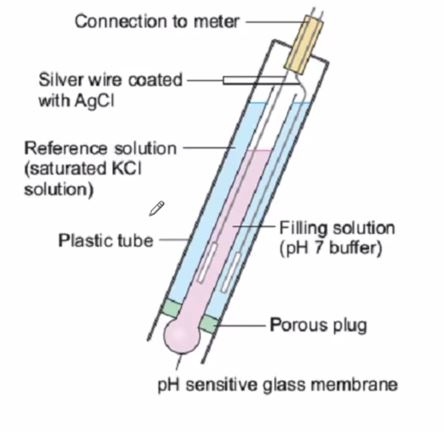

## Chemistry  
Operators need to understand basic chemistry in order to be a successful operator. This section discusses some of the most important topics an operator must know.

* Acids & Bases  
* Concentration & Dillution  
* Periodic Table of Elements  
* Density   
* Titration    
* Glassware, Equipment, and Analytical Equipment  
* Working with Numbers  

## Acids & Bases  

Acids and bases are used in our treatment process. It is important to understand the basic properties of these chemicals so that you can safely handle them and predict how they will react with other chemicals.

Acids have a pH below 7. Bases have a pH above 7. Typically, most chemicals or solutions will have a pH within the range of 0 to 14.
$$\require{mhchem}$$

Before we can discuss the meaning of pH, you must first understand some chemical properties of water (\(\ce{H2O}\)). One of them is that water is in equilibrium with hydronium and hydroxyl ions depicted in the reaction shown below.

$$\ce{H2O_{(l)} \rightleftharpoons H^+_{(aq)} + OH^{-}_{(aq)}}$$

Note: \(H^+\) is shorthand for \(\ce{H3O^+}\). The proton ion \(H^+\) associates with water molecule.

Water (on the left) is in equilibrium with \(H^+\) (hydronium) and \(OH^-\) (hydroxyl) ions. This means that water is dynamic; it is constantly converting between water and its parts. Other chemicals behave in the same manner.

You can measure how many \(H^+\) are in solution. This is typically done with several electrodes. In the probe shown in the image below, there is both a reference electrode and a pH electrode. The pH electrode has a glass bulb and is inserted into the solution that needs to be measured. The reference electrode is inside the body of the probe.

When you insert the pH probe into a solution, an electrial potential will develop across the pH electrode (outside electrode vs inside electrode). The more \(H^+\) ions in solution, the greater the potential. When you compare this potential to the potential of the reference electrode, you can determine how many \(H^+\) ions are in solution. As it turns out, the relationship between potential and pH is -59.18 mV/pH.

So, what exactly is pH? 

When you measure pH, you are measuring the concentration of \(H^+\) ions. However, there are a wide range of \(H^+\) ions that are typically observed. Instead of reporting a value of 0.0000007 moles / L or 0.1 moles / L of hydronium ions, is more convient to use the log of concentration.

$$pH = -log\ce{[H^{+}]}$$

pH | \(\ce{[H^{+}]}\)
------------ | ------------- 
0 | 1 
1 | 0.1 
2 | 0.01
3 | 0.001
4 | 0.0001
5 | 0.00001
6 | 0.000001
7 | 0.0000001
8 | 0.00000001
9 | 0.000000001
10 | 0.0000000001
11 | 0.00000000001
12 | 0.000000000001
13 | 0.0000000000001
14 | 0.00000000000001

Increasing the pH by 1, decreases the concentration of hydronium ions by a factor of 10.   

For more information about what "log" means, visit the [Kahn Academy website](https://www.khanacademy.org/math/algebra2/exponential-and-logarithmic-functions/introduction-to-logarithms/v/logarithms).

For more information about acids, bases, and pH, visit the following [Kahn Academy video](https://www.khanacademy.org/science/chemistry/acids-and-bases-topic/acids-and-bases/v/arrhenius-definition-of-acids-and-bases). There are a number of videos in this series.

## Concentration & Dillution  

Often, chemicals are purchased in a concentrated form. A solution of a weaker concentration is made by mixing a concentrated chemical with water (or another chemical).

The equation which is often very helfpul to us is:

$$v_1c_1=v_2c_2$$

where \(v_1\) is volume of the undilluted chemical, \(c_1\) is the concentration of undilluted chemical, \(v_2\) is the volume of the dilluted chemical, and \(c_2\) is the concentration of the dilluted chemical.

Let's say we want to make 100 mL of 5% hydrochloric acid using concentrated hydrochloric acid that has a strength of 37%.

In this case, we need to solve for \(v_2\).

$$v_1=\frac{v_2c_2}{c_1}=\frac{100 mL \times 5\%}{37\%}=14mL$$

So 14 mL of concentrated hydrochloric acid should be dilluted to 100 mL using water (86 mL of water) to make 100 mL of 5% hydrochloric. 

!!! Caution
	Never add water to concentrated acid. The solution can heat up too fast and splash out of vessel. Always add concentrated acid to water.

## Periodic Table of Elements  

Everything in the universe is made out of atoms. Atoms exhibit specific properties based on how many electrons, protons, and neutrons are in the atom. Specifically, the number of protons in an atom determines what element it is. For example, an atom with 12 protrons is called magnesium. In other words, an atom is a single particle of an element.

All of the known elements are typically presented in what is called a periodic table of elements.

[Visit this link to see an interactive periodic table.](http://www.ptable.com/)

Everything in the known universe is made out of these elements, including everyday chemicals. Elements are a special type of chemical; they consist of just one type of atoms.

Compounds are a mixture of atoms that are bonded together at the atomic level. One example is table salt; it is made out of sodium (\(Na\)) and chorine (\(Cl\)) atoms. Table salt has unique properties--it does not exhibit properties of chlrine nor does it exhibit the properties of sodium.

*Hint: you can use the periodic table to read chemical formulas. For instance, the chemical formula for water is \(\ce{H_2O}\); one molecule is made out of 2 hydrogen atoms (\(H\)) and 1 oxygen (\(O\)) atom.*

## Density  

Density is a property of a chemical that describes how much mass is contained in a unit of volume. For instance, the density of water is 1 gram per 1 mL of water. Alternatively, the density of water can be expressed as 8.34 lbs per gallon (approximately true around at "normal" water temperatures).

The denser the material, the "heavier" it is. Consequently, denser materials sink to the bottom and less dense materials float to the top. This is why ice forms on top of a lake instead of sinking to the bottom; ice is less dense than water.

Sometimes, density is expressed as "specific gravity". This a ratio of densities: the density of a chemical compared to the density of pure water. For example, if the specific gravity of a chemical is 1.2, this means it has a density of \(1.2 \times 8.34 \frac {lbs}{gal}= 10 \frac {lbs}{gals}\).

## Titration  

## Glassware, Equipment, and Analytical Equipment  

## Working with Numbers

Precision and accuracy are important concepts in chemistry. You need to be careful when you work with numbers of different precisions.  

For instances, let's say you want to add a very precise number (i.e. 2004.214 g) to a number of low precision (i.e. 2000 g). How do you report the sum? 

Before we can answer that, you need to understand significant digits.

### Significant Digits

There are three rules on determining how many significant figures are in a number:

* Non-zero digits are always significant.  
* Any zeros between two significant digits are significant.  
* A final zero or trailing zeros in the decimal portion ONLY are significant.

Please remember that, in science, all numbers are based upon measurements (except for a very few that are defined). Since all measurements are uncertain, we must only use those numbers that are meaningful.  A common ruler cannot measure something to be 22.4072643 cm long. Not all of the digits have meaning (significance) and, therefore, should not be written down. In science, only the numbers that have significance (derived from measurement) are written.

#### Adding and Subtracting

For addition and subtraction, look at the decimal portion (i.e., to the right of the decimal point) of the numbers ONLY. Here is what to do:

1) Count the number of significant figures in the decimal portion of each number in the problem. (The digits to the left of the decimal place are not used to determine the number of decimal places in the final answer.)

2) Add or subtract in the normal fashion.

3) Round the answer to the LEAST number of places in the decimal portion of any number in the problem. 

Example: What is the sum of 2.25 and 0.025?

While it is true the sum is 2.275, the value should reflect the reliability of the least precise operation. The answer should be reported as 2.28. 

#### Multiplying and Dividing

In mathematical operations involving significant figures, the answer is reported in such a way that it reflects the reliability of the least precise operation. Let's state that another way: a chain is no stronger than its weakest link. An answer is no more precise that the least precise number used to get the answer. Let's do it one more time: imagine a team race where you and your team must finish together. Who dictates the speed of the team? Of course, the slowest member of the team. Your answer cannot be MORE precise than the least precise measurement.  

The following rule applies for multiplication and division:

The LEAST number of significant figures in any number of the problem determines the number of significant figures in the answer.

This means you MUST know how to recognize significant figures in order to use this rule.  
Example #1: 2.5 x 3.42.

The answer to this problem would be 8.6 (which was rounded from the calculator reading of 8.55). Why?

2.5 has two significant figures while 3.42 has three. Two significant figures is less precise than three, so the answer has two significant figures. 

___